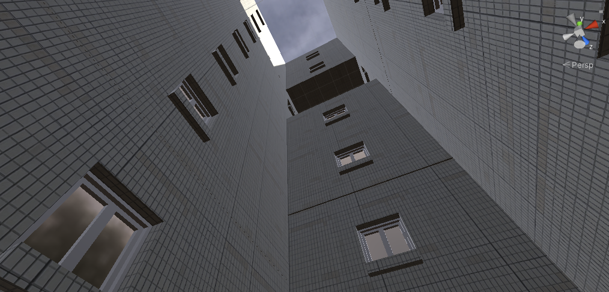

# HighRiseSurfers
_My first game._

## Installation

Just download the Build folder from the GitHub repository and run the .exe file.

## How to play

### Movement mechanics

Move your mouse to move the Surfer around. Avoid obstacles! The game will restart if you fly into one.

### Coins

Try to pick up 50 coins -- but you can collect up to 56 if you really want to :-)
Your current coin count is displayed in the top left corner.

### Powerups

- The **Zone 30 Sign** Powerup halves the movement speed for 30 seconds;
- The **Large Blue Coin** is located at the end of the level. It closes the game. (You won!)

### Exiting the game

To quit the game, use the "Exit" button in the top right corner.

